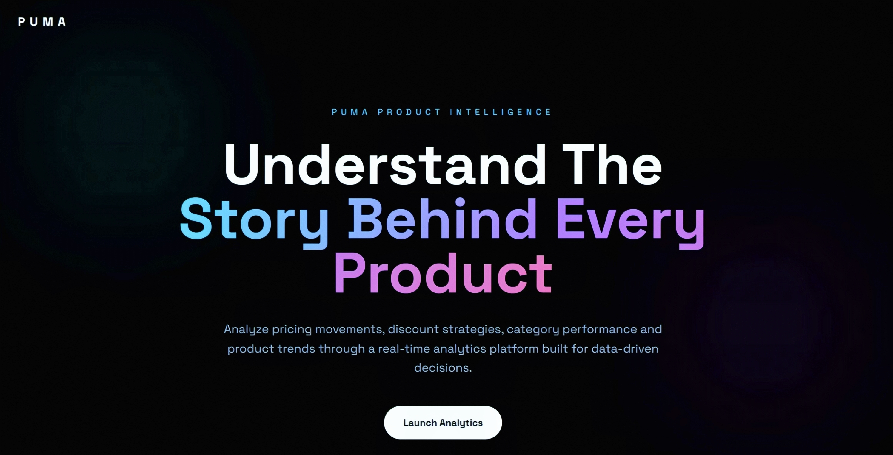
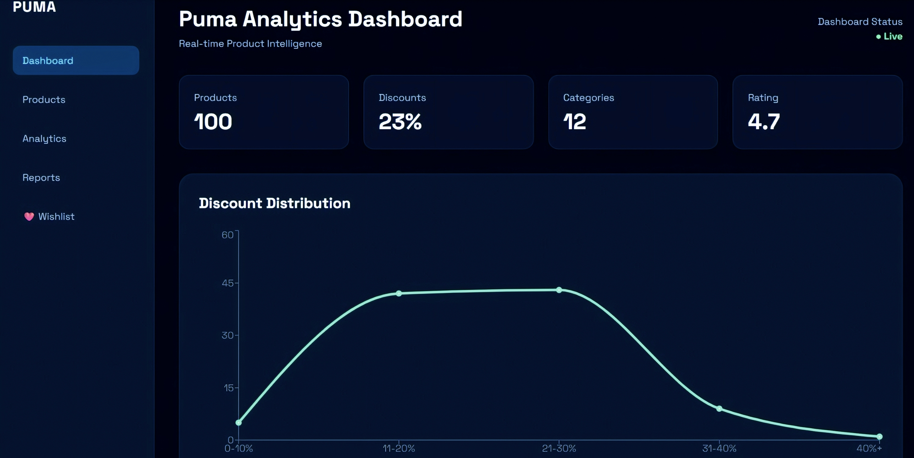
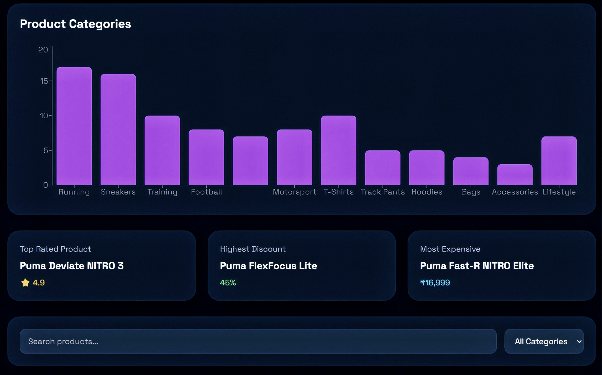
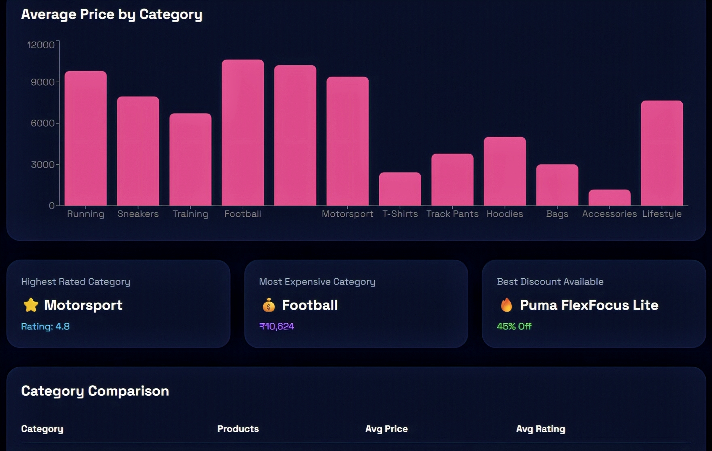
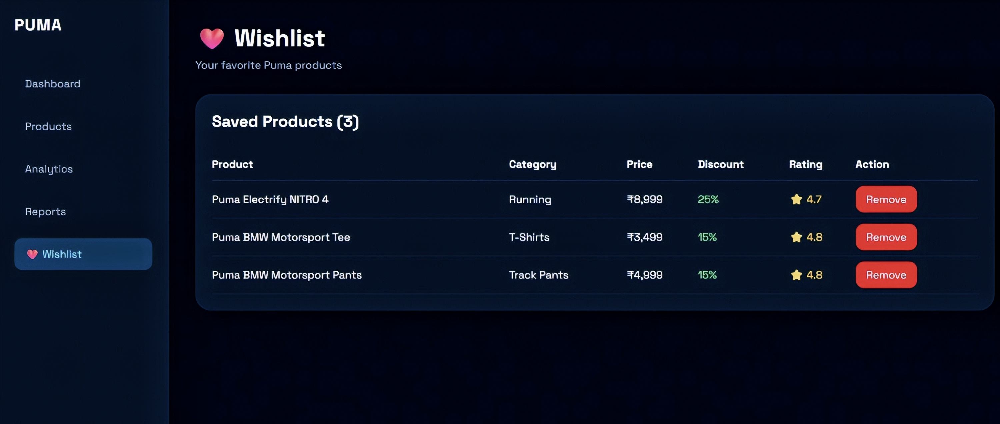

<h1 align="center">
✨ Puma Product Intelligence Dashboard ✨
</h1>

<p align="center">
  
</p>

<p align="center">
Transforming Product Data into Actionable Business Insights
</p>

<p align="center">


</p>

---

# 📖 Overview

**Puma Product Intelligence Dashboard** is a full-stack analytics platform designed to transform product data into meaningful business insights.

The application provides interactive visualizations and key performance metrics to analyze product pricing, discounts, ratings, and category trends. It enables users to explore products efficiently and manage a personalized wishlist through a responsive and modern interface.

The project currently uses a dataset of **100 Puma products**, stored in **MongoDB Atlas**, and exposes REST APIs built with **Express.js**. The frontend is developed using **React**, **Tailwind CSS**, and **Recharts** to deliver an intuitive analytics experience.

### 🎯 Key Highlights

- 📦 100 Product Dataset
- 📊 Interactive Analytics Dashboard
- ❤️ Wishlist Management System
- 🔍 Product Search & Category Filtering
- 📈 Multiple Data Visualizations
- 🌙 Modern Dark Theme UI
- ⚡ Full Stack MERN Architecture
- 🌐 Deployed on Vercel and Railway

---

# 📸 Dashboard Preview

## 🏠 Landing Page



---

## 📊 Dashboard



---

## 📦 Products Page



---

## 📈 Analytics Page



---

## ❤️ Wishlist Page



---

# ✨ Features

## 📊 Analytics Dashboard

- KPI Summary Cards
- Product Growth Trend Visualization
- Category Distribution Analysis
- Price Distribution Overview
- Discount Distribution Analysis
- Average Rating by Category
- Average Price by Category
- Interactive Charts powered by Recharts

---

## 🔍 Product Exploration

- Product Search Functionality
- Category Filtering
- Dynamic Product Insights
- Responsive Product Interface

---

## ❤️ Wishlist Management

- Add Products to Wishlist
- View Saved Products
- Remove Products from Wishlist
- Persistent Wishlist Storage using MongoDB

---

## ⚙️ Backend & APIs

- RESTful API Architecture
- Product Management Endpoints
- Wishlist Management Endpoints
- MongoDB Atlas Integration
- Express.js Backend

---

## 📱 User Experience

- Modern Dark Theme UI
- Fully Responsive Design
- Smooth Navigation with React Router
- Interactive Data Visualizations
- Optimized for Desktop and Mobile Devices

---

# 🛠 Tech Stack

## 🎨 Frontend

- ⚛️ React 19
- ⚡ Vite
- 🎨 Tailwind CSS v4
- 📡 Axios
- 🔀 React Router DOM
- 📊 Recharts

---

## ⚙️ Backend

- 🟢 Node.js
- 🚀 Express.js
- 🍃 MongoDB Atlas
- 🗄️ Mongoose
- 🌐 CORS
- 🔐 dotenv

---

## ☁️ Deployment

- ▲ Vercel
- 🚂 Railway

---

## 🧰 Development Tools

- 🔄 Nodemon
- ✅ ESLint
- 📦 npm
- 🖥️ VS Code
- 🐙 Git & GitHub

---

# 📂 Project Structure

```text
Puma-Product-Intelligence-Dashboard
│
├── backend
│   ├── controllers
│   ├── models
│   ├── routes
│   ├── .gitignore
│   ├── package-lock.json
│   ├── package.json
│   ├── seeder.js
│   └── server.js
│
├── public
│
├── screenshots
│   ├── Analytics.jpeg
│   ├── Dashboard.jpeg
│   ├── Homepage.jpeg
│   ├── Product.jpeg
│   └── Wishlist.jpeg
│
├── src
│   ├── assets
│   ├── components
│   ├── pages
│   ├── App.css
│   ├── App.jsx
│   ├── index.css
│   └── main.jsx
│
├── .gitignore
├── eslint.config.js
├── index.html
├── LICENSE
├── package-lock.json
├── package.json
├── README.md
└── vite.config.js
```

---

# 🚀 Installation & Setup

## 1️⃣ Clone the Repository

```bash
git clone https://github.com/divyanshiii01/Puma-Product-Intelligence-Dashboard.git

cd Puma-Product-Intelligence-Dashboard
```

---

## 2️⃣ Install Frontend Dependencies

```bash
npm install
```

---

## 3️⃣ Install Backend Dependencies

```bash
cd backend

npm install
```

---

## 4️⃣ Configure Environment Variables

Create a `.env` file inside the `backend` directory:

```env
MONGO_URI=your_mongodb_connection_string

PORT=5000
```

---

## 5️⃣ Start the Backend Server

```bash
cd backend

npm run dev
```

---

## 6️⃣ Start the Frontend Application

Open another terminal:

```bash
npm run dev
```

---

## 7️⃣ Open the Application

Frontend:

```text
http://localhost:5173
```

Backend:

```text
http://localhost:5000
```

---

# 🔗 API Endpoints

## 📦 Products API

| Method | Endpoint | Description |
|----------|----------|-------------|
| GET | `/api/products` | Retrieve all products |
| POST | `/api/products` | Create a new product |
| PUT | `/api/products/:id` | Update an existing product |
| DELETE | `/api/products/:id` | Delete a product |

---

## ❤️ Wishlist API

| Method | Endpoint | Description |
|----------|----------|-------------|
| GET | `/api/wishlist` | Retrieve wishlist items |
| POST | `/api/wishlist` | Add a product to the wishlist |
| DELETE | `/api/wishlist/:id` | Remove a product from the wishlist |

---

### 🌐 Base URL

#### Production API

```text
https://puma-analytics-dashboard-production.up.railway.app
```

#### Products Endpoint

```text
https://puma-analytics-dashboard-production.up.railway.app/api/products
```

---

# 🌐 Live Demo

Experience the application through the deployed links below:

## ▲ Frontend Application

```text
https://puma-analytics-dashboard.vercel.app/
```

---

## 🚂 Backend API

```text
https://puma-analytics-dashboard-production.up.railway.app/
```

---

## 🔗 Products API Endpoint

```text
https://puma-analytics-dashboard-production.up.railway.app/api/products
```

---

# 📈 Future Improvements

- 🖼️ Product Image Integration
- 🤖 Automated Data Scraping
- 📄 Pagination Support
- 🔃 Product Sorting Options
- 🔐 User Authentication
- 📊 Additional Analytics & Visualizations
- 📥 Export Reports & Insights
- 📱 Enhanced Mobile Experience

---

# 👩‍💻 Author

**Divyanshi**

- GitHub: [@divyanshiii01](https://github.com/divyanshiii01)

---

# 📄 License

This project is licensed under the **MIT License**.

See the [LICENSE](LICENSE) file for more details.

---

<div align="center">

⭐ If you found this project interesting, consider giving it a star!

Made with ❤️ using React, Express, MongoDB, and Tailwind CSS.

</div>
